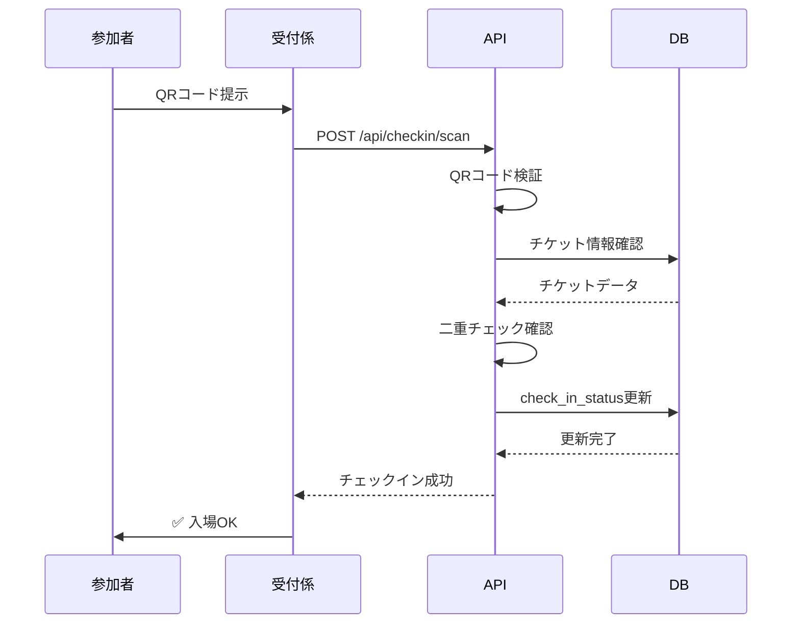
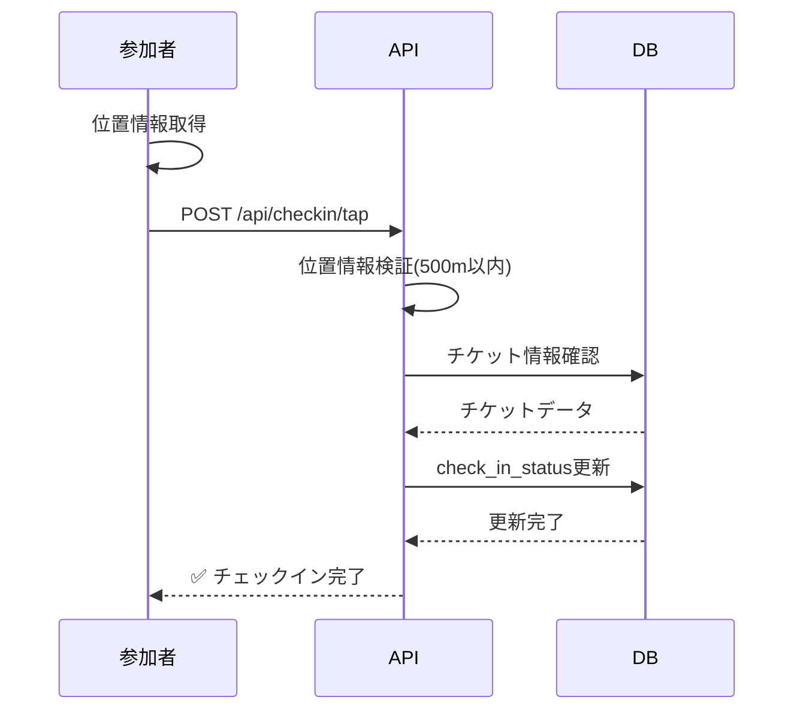

# 🎫 LinkUp QR入場管理システム

## 📱 概要

LinkUpのQR入場管理システムは、主催者と参加者の両方にスムーズな受付体験を提供します。

---

## 🌟 主要機能

### 主催者側（受付アプリ）

#### 1. **QRコードスキャン受付**
- スマートフォンのカメラでQRコードを読み取り
- 0.5秒以内に認証完了
- 二重入場を自動検知
- オフライン対応（ネットワーク不安定時）

#### 2. **タップ受付**
- 参加者がアプリで「タップ受付」ボタンを押下
- 位置情報で会場付近かを確認（500m以内）
- ワンタップでチェックイン完了

#### 3. **リアルタイム統計**
- 現在の来場者数 / 総申込者数
- チケット種類別の来場率
- 時間帯別の来場推移グラフ

#### 4. **参加者リスト管理**
- 全参加者の一覧表示
- チェックイン状況の確認
- 名前・メールアドレス検索
- 手動チェックイン機能

### 参加者側（チケット表示）

#### 1. **QRコードチケット**
- 高解像度QRコード表示
- 印刷用PDF生成
- Apple Wallet / Google Pay 対応（将来実装）

#### 2. **タップ受付**
- 位置情報を使った自動チェックイン
- 会場に到着したらワンタップ
- 受付列に並ぶ必要なし

---

## 🔐 セキュリティ設計

### QRコード生成

```typescript
QRコードデータ形式:
LINKUP:orderTicketId:timestamp:HMAC-SHA256-signature

例:
LINKUP:a1b2c3d4-e5f6:1706745600000:3f8a9b2c1d...
```

#### セキュリティ機能
1. **HMAC-SHA256署名** - 改ざん防止
2. **タイムスタンプ検証** - 発行から24時間以内のみ有効
3. **ワンタイム検証** - 二重入場防止
4. **暗号化通信** - TLS 1.3

### 二重チェックイン防止

```sql
-- チェックイン時にステータス確認
SELECT check_in_status FROM order_tickets WHERE order_ticket_id = ?

-- すでに'checked_in'ならエラー
-- 'pending' → 'checked_in' に更新
```

---

## 📊 データベーステーブル

### order_tickets テーブル

```sql
CREATE TABLE order_tickets (
  order_ticket_id TEXT PRIMARY KEY,
  order_id TEXT NOT NULL,
  ticket_id TEXT NOT NULL,
  attendee_name TEXT,
  attendee_email TEXT,
  qr_code_url TEXT,              -- R2のQRコード画像URL
  qr_code_data TEXT,             -- QRコード内容(署名付き)
  check_in_status TEXT CHECK(check_in_status IN ('pending', 'checked_in', 'cancelled')) DEFAULT 'pending',
  checked_in_at DATETIME,
  checked_in_by TEXT,            -- 受付担当者のuser_id
  created_at DATETIME DEFAULT CURRENT_TIMESTAMP,
  FOREIGN KEY (order_id) REFERENCES orders(order_id) ON DELETE CASCADE,
  FOREIGN KEY (ticket_id) REFERENCES tickets(ticket_id)
);

CREATE INDEX idx_order_tickets_qr ON order_tickets(qr_code_data);
```

---

## 🔌 API エンドポイント

### 1. QRコード生成

```http
POST /api/checkin/generate
Authorization: Bearer {jwt_token}

Request:
{
  "order_ticket_id": "a1b2c3d4-e5f6-7890-abcd-1234567890ab"
}

Response:
{
  "success": true,
  "qr_code_url": "https://pub-xxx.r2.dev/qr/a1b2c3d4.png",
  "qr_code_data": "LINKUP:a1b2c3d4:1706745600000:3f8a9b2c...",
  "ticket": {
    "order_ticket_id": "a1b2c3d4-e5f6-7890-abcd-1234567890ab",
    "event_title": "Web3カンファレンス 2026",
    "attendee_name": "山田太郎"
  }
}
```

### 2. QRスキャン受付

```http
POST /api/checkin/scan
Authorization: Bearer {jwt_token}

Request:
{
  "qr_code_data": "LINKUP:a1b2c3d4:1706745600000:3f8a9b2c...",
  "event_id": "event-uuid",
  "device_id": "device-uuid",
  "location": {
    "latitude": 35.6812,
    "longitude": 139.7671
  }
}

Response (成功):
{
  "success": true,
  "message": "Check-in successful!",
  "ticket_info": {
    "order_ticket_id": "a1b2c3d4-e5f6-7890-abcd-1234567890ab",
    "attendee_name": "山田太郎",
    "attendee_email": "yamada@example.com",
    "event_title": "Web3カンファレンス 2026",
    "checked_in_at": "2026-01-31T15:30:00Z"
  }
}

Response (二重チェックイン):
{
  "error": "Already checked in",
  "success": false,
  "checked_in_at": "2026-01-31T14:00:00Z",
  "ticket_info": {
    "attendee_name": "山田太郎",
    "event_title": "Web3カンファレンス 2026"
  }
}
```

### 3. タップ受付

```http
POST /api/checkin/tap
Authorization: Bearer {jwt_token}

Request:
{
  "order_ticket_id": "a1b2c3d4-e5f6-7890-abcd-1234567890ab",
  "event_id": "event-uuid",
  "location": {
    "latitude": 35.6812,
    "longitude": 139.7671
  }
}

Response:
{
  "success": true,
  "message": "タップ受付が完了しました!",
  "ticket_info": {
    "attendee_name": "山田太郎",
    "event_title": "Web3カンファレンス 2026",
    "checked_in_at": "2026-01-31T15:30:00Z"
  }
}
```

### 4. 受付統計取得

```http
GET /api/checkin/stats/:eventId
Authorization: Bearer {jwt_token}

Response:
{
  "success": true,
  "stats": {
    "total_tickets": 250,
    "checked_in": 180,
    "pending": 65,
    "cancelled": 5,
    "check_in_rate": "72.0"
  },
  "time_distribution": [
    { "hour": "14:00", "count": 45 },
    { "hour": "15:00", "count": 78 },
    { "hour": "16:00", "count": 57 }
  ]
}
```

### 5. 参加者リスト取得

```http
GET /api/checkin/list/:eventId
Authorization: Bearer {jwt_token}

Response:
{
  "success": true,
  "attendees": [
    {
      "order_ticket_id": "a1b2c3d4...",
      "attendee_name": "山田太郎",
      "attendee_email": "yamada@example.com",
      "check_in_status": "checked_in",
      "checked_in_at": "2026-01-31T15:30:00Z",
      "ticket_name": "一般チケット",
      "order_number": "LINK20260131001"
    },
    ...
  ]
}
```

---

## 📱 フロントエンド実装例

### QRコードスキャナー

```typescript
// components/QRScanner.tsx
import { useState } from 'react';
import { QrReader } from 'react-qr-reader';

export function QRScanner({ eventId }: { eventId: string }) {
  const [scanning, setScanning] = useState(false);

  const handleScan = async (data: string | null) => {
    if (!data) return;

    setScanning(true);
    try {
      const response = await fetch('/api/checkin/scan', {
        method: 'POST',
        headers: {
          'Content-Type': 'application/json',
          'Authorization': `Bearer ${localStorage.getItem('token')}`,
        },
        body: JSON.stringify({
          qr_code_data: data,
          event_id: eventId,
        }),
      });

      const result = await response.json();
      
      if (result.success) {
        alert(`✅ ${result.ticket_info.attendee_name} チェックイン完了!`);
      } else {
        alert(`❌ ${result.error}`);
      }
    } catch (error) {
      alert('エラーが発生しました');
    } finally {
      setScanning(false);
    }
  };

  return (
    <div>
      <QrReader
        onResult={(result, error) => {
          if (result) handleScan(result.getText());
        }}
        constraints={{ facingMode: 'environment' }}
        className="w-full"
      />
      {scanning && <div>処理中...</div>}
    </div>
  );
}
```

### タップ受付

```typescript
// components/TapCheckin.tsx
export function TapCheckin({ orderTicketId, eventId }: Props) {
  const handleTapCheckin = async () => {
    // 位置情報取得
    const position = await new Promise<GeolocationPosition>((resolve, reject) => {
      navigator.geolocation.getCurrentPosition(resolve, reject);
    });

    const response = await fetch('/api/checkin/tap', {
      method: 'POST',
      headers: {
        'Content-Type': 'application/json',
        'Authorization': `Bearer ${localStorage.getItem('token')}`,
      },
      body: JSON.stringify({
        order_ticket_id: orderTicketId,
        event_id: eventId,
        location: {
          latitude: position.coords.latitude,
          longitude: position.coords.longitude,
        },
      }),
    });

    const result = await response.json();
    
    if (result.success) {
      alert(`🎉 ${result.message}`);
    } else {
      alert(`❌ ${result.error}`);
    }
  };

  return (
    <button
      onClick={handleTapCheckin}
      className="bg-green-500 text-white px-8 py-4 rounded-lg text-xl font-bold"
    >
      タップして受付
    </button>
  );
}
```

---

## 🎨 UI/UXデザイン

### 受付アプリ画面

```
┌─────────────────────────────────┐
│  📷 QRコードスキャン              │
│                                 │
│  ┌─────────────────────────┐   │
│  │                         │   │
│  │   [QRコードカメラ画面]    │   │
│  │                         │   │
│  └─────────────────────────┘   │
│                                 │
│  📊 受付状況                     │
│  ━━━━━━━━━━━━━━━━━━━━━━━━━━   │
│  チェックイン済み: 180 / 250     │
│  来場率: 72%                    │
│                                 │
│  [参加者リストを見る]             │
└─────────────────────────────────┘
```

### 参加者チケット画面

```
┌─────────────────────────────────┐
│  🎫 チケット                      │
│                                 │
│  Web3カンファレンス 2026         │
│  2026年2月15日 14:00〜           │
│                                 │
│  ┌─────────────────────────┐   │
│  │                         │   │
│  │   [QRコード画像表示]      │   │
│  │                         │   │
│  └─────────────────────────┘   │
│                                 │
│  山田太郎 様                     │
│  一般チケット                    │
│                                 │
│  [タップして受付]                 │
│  [QRコードを印刷]                 │
└─────────────────────────────────┘
```

---

## 🔄 受付フロー

### パターン1: QRスキャン



### パターン2: タップ受付



---

## 🚀 今後の拡張機能

- [ ] **NFC受付** - Felica/NFC対応
- [ ] **顔認証** - 生体認証でスムーズ入場
- [ ] **Apple Wallet / Google Pay** - デジタルウォレット統合
- [ ] **オフラインモード** - ネットワーク不要で受付
- [ ] **複数言語対応** - 英語・中国語対応
- [ ] **受付レポート** - PDF/Excel形式でエクスポート

---

## 📞 サポート

QR入場管理システムに関する質問は:
- **Email**: support@linkup.example.com
- **ドキュメント**: https://docs.linkup.example.com

---

**🔗 人と機会を繋げる - LinkUp**
